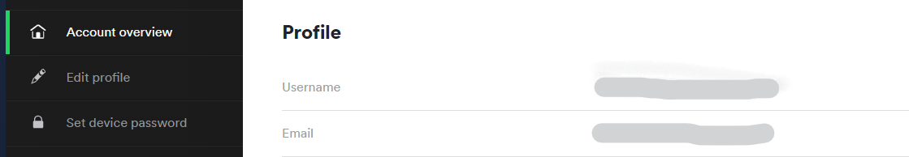
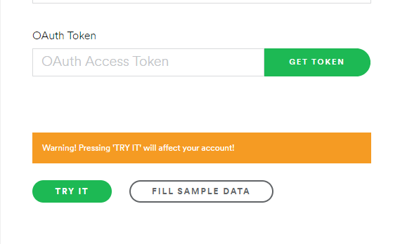
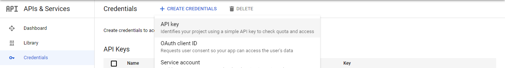

# Automate-Spotify
A node.js app that takes your public playlist videos on Youtube, and generates a Spotify playlist based on the song in your playlist.


## Setup
Get You Spotify User ID and Oauth Token From Spotfiy and add it to secrets.js file

Copy YouTube public playlist url to secrets.js file

  * Get User ID [user id]

    
    
  * Get Oauth Token [Get Oauth]
    
    

  * Get YouTube Api [Google api dashboard] , [YouTube Data API Doc]
  
    


## Run 
```
npm install

node index.js
```

## Troubleshooting
* Spotify Oauth token expires very quickly, If get KeyError this could be caused by an expired token. [Generate a new token]

[user id]: <https://www.spotify.com/us/account/overview/?utm_source=spotify&utm_medium=menu&utm_campaign=your_account>

[Get Oauth]: <https://developer.spotify.com/console/post-playlists/>

[Generate a new token]: <https://developer.spotify.com/console/post-playlists/>


[Google api dashboard]: <https://console.cloud.google.com/apis/dashboard>

[YouTube Data API Doc]: <https://developers.google.com/youtube/v3/getting-started>